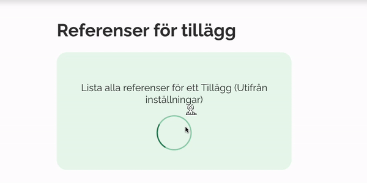

# A application for listing all refrences of a "Tillägg" on a Sitevision website

Fill in the configuration with:
 
1. ID of the application.
 
2. Start node for the skript.
 
Should look something like this: (I'm sorry the cat is not included 😿)
 

